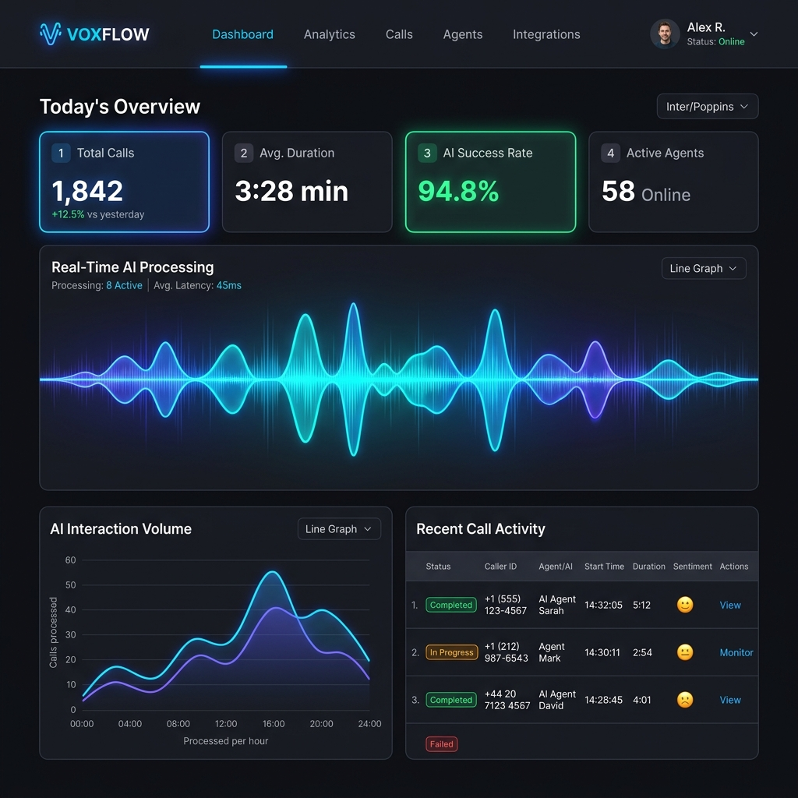

<div align="center">
  

  # 🎙️ VgrowVoice AI
  ### The Intelligent Voice Receptionist & Lead Capture SaaS

  [](https://nextjs.org/)
  [](https://twilio.com)
  [](https://ai.google.dev/)
  [](https://supabase.com)
</div>

---

## 🌟 Overview

**VgrowVoice** is a complete, white-labeled Voice AI SaaS built for modern businesses. It provides an autonomous, real-time AI receptionist capable of handling inbound customer calls, capturing outbound leads, scheduling appointments, and answering FAQs in multiple languages (including English, Telugu, and Hindi).

Built on top of **Google Gemini's Multimodal Live API**, VgrowVoice achieves sub-second latency for natural, human-like voice conversations over the phone.

---

## 🚀 Key Features

- 📞 **Real-Time Voice AI (Sub-second Latency):** Seamless inbound and outbound calling powered by Twilio Media Streams and Gemini Live.
- 🎯 **Native Campaign Form Builder:** A built-in drag-and-drop form builder for Meta/Google Ads. When a customer submits a lead form, the AI calls them instantly.
- 📅 **Automated Appointment Scheduling:** The AI dynamically fetches available business services and books appointments directly into the database.
- 🧠 **Anti-Hallucination Guardrails:** Strict prompt engineering ensures the AI *only* quotes real services, prices, and FAQs configured by the business owner.
- 🌍 **Multilingual Intelligence:** Native support for regional languages with intelligent language detection and switching mid-call.
- 🏢 **Multi-Tenant Architecture:** Built with Supabase RLS (Row Level Security), allowing thousands of businesses to operate securely on a single instance.
- 📊 **Real-time Call Transcripts:** Live streaming transcripts and AI-generated call summaries directly in the dashboard.

---

## 🛠️ Technology Stack

| Category | Technology |
|---|---|
| **Frontend Framework** | Next.js 14 (App Router) |
| **Styling** | Tailwind CSS + Lucide Icons + Framer Motion |
| **Database & Auth** | Supabase (PostgreSQL + RLS) |
| **Telephony** | Twilio (Programmable Voice + Media Streams) |
| **AI Intelligence** | Google Gemini (BidiGenerateContent WebSocket) |
| **State Management** | Zustand |

---

## 🏗️ Architecture

VgrowVoice utilizes a hybrid monolith-microservice architecture designed for Google Cloud Run:

1. **Dashboard (Next.js):** Handles authentication, business configuration, lead management, and campaign forms.
2. **Twilio Bridge (Node.js/WS):** A high-performance WebSocket server that bridges Twilio's `µ-law` audio format with Gemini's `PCM` format in real-time, executing Tool Calls (fetching business info, booking appointments) mid-conversation.

---

## 💻 Local Development

### Prerequisites
- Node.js 20+
- A Supabase Project
- A Twilio Account (with a purchased phone number)
- A Google AI Studio API Key
- Ngrok (for local Twilio webhooks)

### Setup Instructions

1. **Clone the repository:**
   ```bash
   git clone https://github.com/Porallanagaraju13/Vgrow-Voice-AI.git
   cd Vgrow-Voice-AI
   ```

2. **Install dependencies:**
   ```bash
   npm install
   ```

3. **Configure Environment Variables:**
   Create a `.env.local` file in the root directory:
   ```env
   NEXT_PUBLIC_SUPABASE_URL=your_supabase_url
   NEXT_PUBLIC_SUPABASE_ANON_KEY=your_supabase_anon_key
   SUPABASE_SERVICE_ROLE_KEY=your_service_role_key
   NEXT_PUBLIC_GEMINI_API_KEY=your_gemini_key
   TWILIO_ACCOUNT_SID=your_twilio_sid
   TWILIO_AUTH_TOKEN=your_twilio_auth_token
   TWILIO_PHONE_NUMBER=your_twilio_number
   NEXT_PUBLIC_NGROK_URL=your_ngrok_url
   ```

4. **Start the Development Server & Bridge:**
   ```bash
   # Starts Next.js on port 3000 and the Twilio WS Bridge on port 3001
   npm run dev:all
   ```

---

## ☁️ Deployment

VgrowVoice is designed to be deployed to **Google Cloud Run** using a two-service architecture:
- `vgrowvoice-web`: The frontend dashboard.
- `vgrowvoice-bridge`: The WebSocket streaming bridge.

*(Detailed deployment scripts and Dockerfiles coming soon)*

---

<div align="center">
  <i>Built with ❤️ for modern businesses.</i>
</div>
